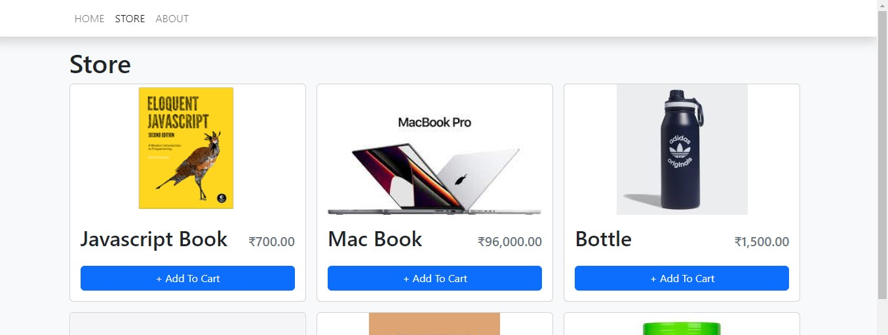
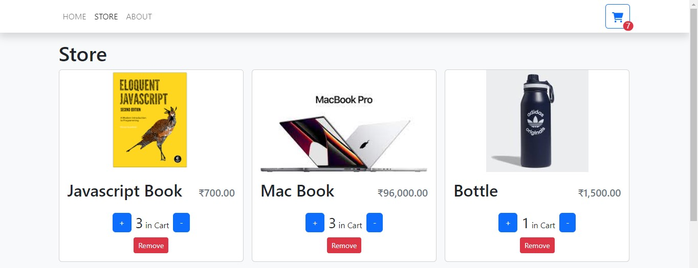
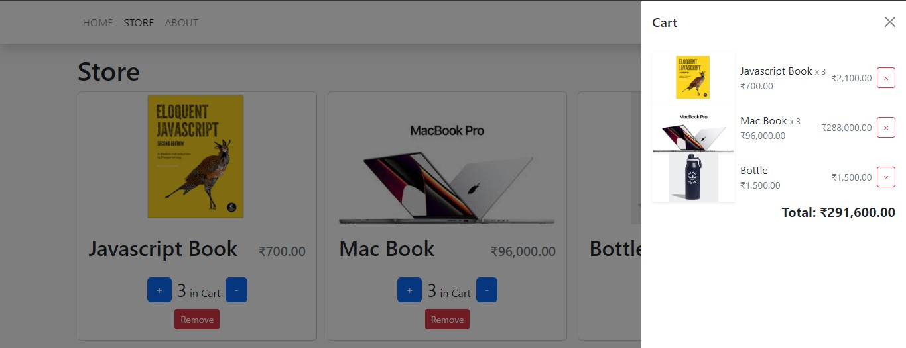

# Shopping-cart-useContext

A shopping cart app using typescript -react and useContext hook

## Techh Stack

**Component-library:** Bootstrap
**State-Management:** useContext()
**Library:** Vite+React+Typescript

## [Demo](https://unique-frangipane-fafb53.netlify.app)

# Features

#### Store Page



### Adding Items



### Cart Items



## Run Locally

Clone the project

```bash
  git clone https://github.com/Lokesh01/Shopping-cart-useContext
```

Go to the project directory

```bash
  cd shopping_cart_ts
```

Install dependencies

```bash
  npm install
```

Start the server

```bash
  npm run start
```

Start the Client

## Made By

- [@Lokesh01](https://github.com/Lokesh01)
